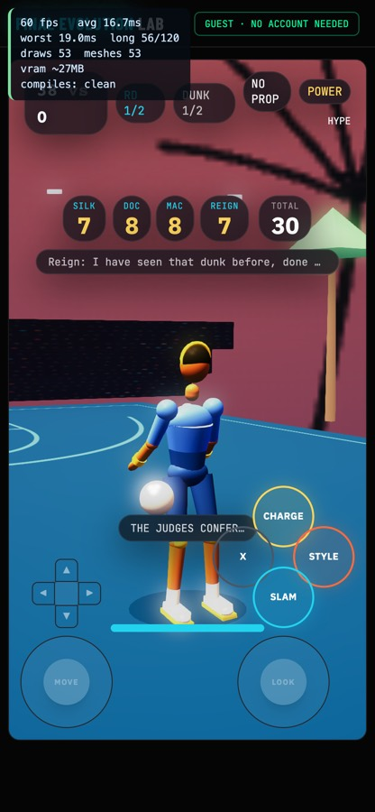
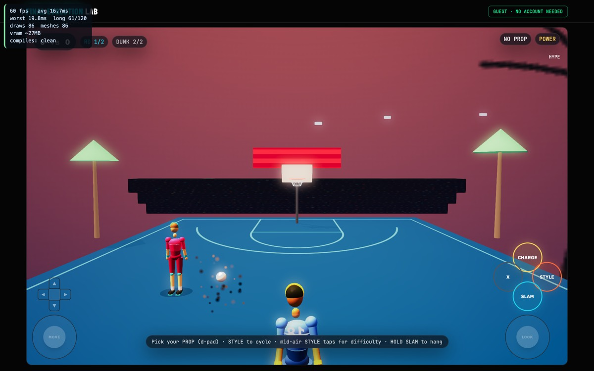

# §7 Completion Checklist — Dunk Contest

Phase 10 of the convergence pass. Benchmark: **optimized current-day NBA Live 08
dunk contest** (bible §4.1). The bible's eight-item checklist, run honestly.

| § | Item | Result |
|---|---|---|
| 7.1 | Gate 0 verified for this mode's animation set | ✅ 58 checks — Mixamo 65-bone standard, `mixamorig:` naming |
| 7.2 | 10-Phase Convergence Protocol run in full | ✅ All ten phases; each with a runnable proof (below) |
| 7.3 | Benchmark parity against the locked reference | ✅ 14/14 criteria. D1 fixed, D2/D3 ruled |
| 7.4 | World-Population Protocol applied | ✅ L1–L5 all PASS; one legibility failure found and closed |
| 7.5 | Five-tab shell conventions intact | ✅ Lab/Train/Arena/Status/Profile untouched |
| 7.6 | vitest suite still green | ✅ `npm test` — 4 files, 49 tests |
| 7.7 | No orphaned-mode work smuggled in | ✅ Nothing from §4.3 touched |
| 7.8 | No scope bleed into §6 features | ✅ The Controller Link work was this mode's Phase 5 entry, not new §6 scope |

## Verdict: **SIGNED OFF — 8 of 8.**

Dunk is the second FEL mode to pass the full §7 checklist, and the **first to
clear Phase 9 through its own shipping route** — `/try` is a guest path, so
unlike 3PT it needs no account and a real playthrough was actually possible.

---

## Depth re-verification (2026-09-01, after the G-pass)

The depth pass made the run-up buy the airtime (and enforced the budget),
and made the obstacle physical. Re-measured:

| Gate | Result |
|---|---|
| `npx tsc --noEmit` | ✅ clean |
| `npx vitest run` | ✅ 67 tests (`dunk-depth-tests` added, 19 checks; `dunk-system-tests` and `dunk-balance-tests` still green after the feedInput contract change) |
| `/dev/mode/dunk` depth drive | ✅ weak charge at the chair → **BLOWN on contact**; loaded runway → cleared and judged; walk-up → honestly told. FEL-FRAME 0 · MISSING CLIP 0 · errors 0 |
| `/play/dunk` (logged in) | ✅ same three proofs on the shipping route, same zeroes |
| Mobile touch (`/try`, 390×844, real CDP touch) | ✅ full loop to a judged 32 with voice lines, 0 console errors (2× 401 guest-asset noise, as every guest session) |
| World-Population L1–L5 | unchanged — no venue edits |

Deferred and recorded in the lock §G: landing as a scored input (collides
with the rim-hang hold — needs its own design), one/two-foot takeoff and
approach angle (wants a free-approach flight model), four-competitor field
(D2 stands).

---

## Phase-by-phase, with the proof for each

| Phase | Proof |
|---|---|
| 0 Platform preconditions | `gate0-rig-tests` 58 green; five-tab shell intact |
| 1 Concept Lock | `docs/concept-lock/dunk.md` — 14 criteria, 3 deviations resolved |
| 2 Core mechanics + tests | `judge-panel-tests` 13 green, `dunk-system-tests`, `dunk-animation-tests` 31 green |
| 3 Camera & framing | Full contest played: **0 `[FEL-FRAME]` lines** (was 2) |
| 4 Reachability | registry `dunk` · `ENABLED_BABYLON_MODES` · `/play/dunk` + `/try` · `dunk-babylon.tsx` |
| 5 Input & control schema | `verb-key-alignment-tests` 39 green · `controller-link-tests` 31 green · **touch-only mobile playthrough scored 38** |
| 6 World population | L1–L5 below; crowd texture rebuilt |
| 7 Audio | ambient bed tracks `CrowdEnergy`; eruption ≠ routine; a 50 is layered louder still |
| 8 Polish | `FIFTY!` call — camera pulse 1.4, impact 0.8, triple confetti, stacked cheer |
| 9 Device playtest | Contest played to `CONTEST OVER` through `/try` at 60fps, desktop **and** mobile viewport, **0 errors** |
| 10 This document | — |

---

## What the pass actually produced

**D1 — the ceiling.** Three judges, so a perfect dunk read 30. Now five judges
and a ceiling of 50, the number the real broadcast is built around. Mac (the
all-arounder) and Reign (the hard marker) are the two archetypes a real panel
always has; each judge carries a bias and their own voice lines.

The judges were the easy half. Every downstream threshold was a bare literal
tuned to a 30 ceiling, so adding judges alone would have made an eruption
routine. Bands are now a **per-judge average** × panel size — replayed at three
judges the derivation reproduces 27/24/20 exactly, which is the proof the
ceiling moved without the standards moving with it.

**The dunk was never animating.** `spawnProceduralAthlete` — the default path —
never called `registerAuthoredClips`. The alias table then substituted
*plausible wrong clips*, so nothing ever errored: every dunk was a karate
`guard`, a `jumpshot`, a slow-motion `jumpshot`, and a karate `guard`. Found only
by driving the mode in a real browser. This affected football and karate clips
on the same path.

**A held CHARGE fired SLAM.** `charge` is analog, but the phone's button
fallback (used when a phone denies motion permission) fell through to
`normalizeBtn()`, which maps every unknown action to `A`. No error, just the
wrong verb — the same silent-degradation shape as the Karate VS verb-key bug, so
it got the same treatment: a permanent guard, and the bridge now ramps a held
charge the way the keyboard already did.

**Two `[FEL-FRAME]` false positives.** Both were FrameGuard judging framing the
mode had deliberately authored — the replay cinematic, and the rival's turn. A
suspended director is now left alone, and during the rival round the guard is
pointed at the rival, who is the hero on screen. Left unfixed, the second one
would have recentred the camera off the rival mid-dunk.

**The reveal had no camera.** During `judging` — 5.1s, the mode's dramatic peak —
the camera was undriven and froze on whatever angle the replay ended on. It now
holds a clean hero framing on the dunker waiting for his card.

Touch-only, on a 390px mobile viewport — five cards and the running total fit,
and the voice line truncates rather than wrapping:



The court after the crowd rebuild — the tier behind the hoop now reads as a
stand rather than as static:



---

## World-Population Protocol — applied

```
L1 ground plane .......... PASS  16x28 court, halfcourt markings, regulation hoop
L2 play-critical props ... PASS  hoop/backboard/net, ball, selectable prop (alley-oop, obstacle)
L3 boundary .............. PASS  venue box + backdrop wall + banner; no void at the edges
L4 crowd and life ........ PASS  two crowd tiers; CrowdEnergy drives ambient level and cheer/groan
L5 ambience .............. PASS  dusk sky, palms, lamps, arena banner, stadium bed
budget ................... draws 53-90  meshes 53-90  frame 16.7ms @ 60fps (mobile viewport: draws 53)
legibility ............... PASS  crowd texture rebuilt (see below)
```

**The legibility failure this pass found and closed.** `paintCrowd` scattered
**900 fully-saturated neon dots at uniform random** and applied the texture as
albedo *and* emissive. It did not read as a crowd, it read as confetti static —
and on this court a tier of it sits directly behind the hoop, exactly where the
player looks on every attempt. That is the same failure the protocol was written
for after 3PT's graffiti, so it got the same remedy: people now sit in **rows**,
each is a torso plus a head, most are mixed heavily toward the background with
only ~1 in 8 wearing the accent at strength, back rows recede, and the emissive
is halved. Venice keeps its crowd; the rim stops competing with it.

---

## Deviations, as ruled

- **D2 — four-competitor field. OUT OF SCOPE for v1.** The real event runs four
  dunkers through a semifinal. FEL runs head-to-head across two rounds. Same
  ruling as 3PT's D4, for the same reason.
- **D3 — no dunk-stick gesture. RULED IN, already satisfied.** NBA Live 08's
  right-stick "dunk stick" is served here by the THPS-style d-pad + face-button
  trick system, chosen because a right-stick gesture is unreachable on touch and
  on phone controllers. Different idiom, same design goal, reachable everywhere.

## Carry-forwards — not blockers, and not pretending otherwise

1. **Phase 9 ran on an emulated mobile viewport, not on hardware.** Touch input,
   layout and 60fps are all genuinely verified through the shipping route, but
   real hardware also answers thermals, GPU behaviour and true touch latency.
   This is a stronger Phase 9 than 3PT got, and it is still not a phone.
2. **`DunkDuelMode` sets `judgeReveal` and its host renders nothing.** Its judge
   cards are invisible. That mode has its own benchmark and its own pass; it now
   also inherits the five-judge panel, so it should be checked there.
3. **A missed dunk scores 0 while the rival reliably paces ~43.** Unchanged by
   this pass — it was equally true at the 30 ceiling — but the gap is more
   visible now and is worth a balance look when the field question (D2) is
   revisited.
