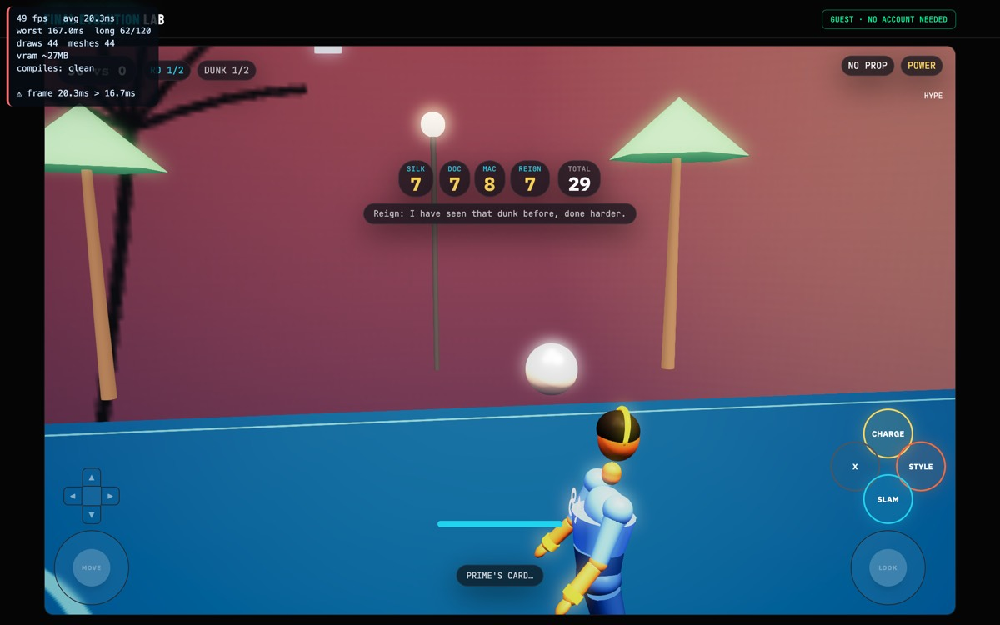
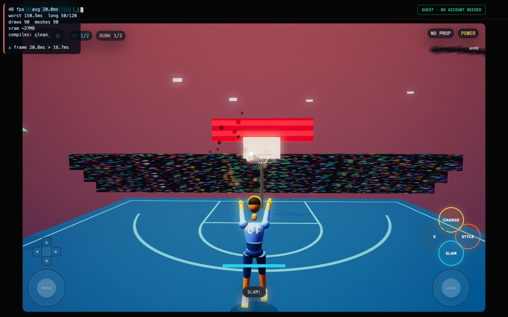

# Concept Lock — Dunk Contest

**Benchmark (LOCKED, bible §4.1): optimized current-day NBA Live 08 dunk contest.**
**Mode id:** `dunk` · **Implementation:** `lib/babylon/modes/DunkMode.ts`

Phase 1 of the convergence pass. NBA Live 08 simulates the real NBA Slam Dunk
Contest, so the format criteria below are the real event's rules — that is what
"parity" means here.

This mode matters more than its slot suggests: it is the **guest onboarding
path**. `/try` — the PLAY NOW button on the landing page — mounts this mode, so
it is the first thing every new player ever sees.

---

## A. Contest format

| # | Criterion | Status | Where |
|---|---|---|---|
| A1 | 2 dunks per round | ✅ | `DUNKS_PER_ROUND = 2` |
| A2 | 2 rounds (qualifying → final) | ✅ | `TOTAL_ROUNDS = 2` |
| A3 | Judges score each dunk 6–10 | ✅ | `JudgePanel` clamps 6–10 |
| A4 | **Five judges; a perfect dunk is 50** | ✅ **D1 FIXED** | `JUDGE_COUNT = 5`, `PERFECT_TOTAL = 50` |
| A5 | Head-to-head against a rival | ✅ | `rivalTotal` |
| A6 | Props allowed (alley-oop, obstacle) | ✅ | `PROPS` |

## B. Dunk vocabulary

| # | Criterion | Status |
|---|---|---|
| B1 | Distinct dunk styles with different difficulty | ✅ `STYLE_TIER` power 3 / flashy 5.5 / sig 8 |
| B2 | Props raise difficulty | ✅ `PROP_BONUS` +2 |
| B3 | Repeating a dunk is punished | ✅ variety memory, −20% for a seen combo |
| B4 | Named mid-air tricks the player chooses | ✅ THPS-style d-pad + face button |

## C. Presentation — where NBA Live 08 spends its budget

| # | Criterion | Status |
|---|---|---|
| C1 | Judges revealed one at a time, not all at once | ✅ `ScoreReveal`, 8 beats, 5.1s |
| C2 | Crowd reacts to the score band | ✅ `CrowdEnergy` |
| C3 | Final round shows the score needed to win | ✅ "THE NEED" |
| C4 | Each judge has a personality/voice | ✅ Silk (style), Doc (execution), Mac (all-round), Reign (hard marker), Prime (difficulty) — distinct weights, biases and voice lines |

---

## D. Deviations

**D1 — Three judges, so a perfect dunk was 30 instead of 50. → FIXED in Phase 2.**
`JUDGES` has three entries (Silk, Doc, Prime) each scoring 6–10, so the ceiling
is 30. The real contest — and NBA Live 08 — uses **five judges, ceiling 50**, and
"**50!**" is the single most recognisable call in the event. A 30-point ceiling
is not a cosmetic difference: it is the number the whole broadcast is built
around, and every player already knows what a perfect dunk should read as.

**How it was fixed.** Two judges were added — Mac, the all-arounder whose card
is the consensus, and Reign, the hard marker who never gives it away. Those are
the two archetypes a real panel always has, and each carries a small `bias` so
five cards read as five PEOPLE rather than one formula sampled five times. Every
judge now has their own voice lines.

The important part was not adding judges, it was the thresholds. Every
downstream number (`CHAIN_THRESHOLD = 24`, the 27/24/20 bands, the momentum
cutoffs, `pickLanding`) was a bare literal tuned to a 30 ceiling, so adding
judges without touching them would have made an eruption routine. Bands are now
stored as a **per-judge average** and multiplied by the panel size — the
hardcoded ceiling *was* the bug, so deriving it means it cannot drift again.
The derivation is proved faithful: replayed at a 3-judge panel it reproduces
27/24/20 exactly, so the ceiling moved and the standards did not.

One balance regression was caught in the process: `hype += dunkTotal * 2` would
have filled the meter almost instantly once totals grew by 5/3. It is now fed by
the per-judge average, which is scale-free and yields the same 36..60 it always
did.

`PERFECT_TOTAL` is now announced — a swept panel fires a **FIFTY!** call with its
own camera pulse and a triple confetti burst. A 50 that scrolled past as an
ordinary eruption would have wasted the whole point of the change.

Verified live at 60fps: `SILK 7 · DOC 7 · MAC 8 · REIGN 7 · PRIME 7 · TOTAL 36`,
each card flipping in turn with the drum hold before Prime. Cards are laid out
in a **row** now — the old vertical stack grew straight down through the banner
at `top-[38%]`, which is exactly where a FIFTY! lands.

**D11 — The contest was neither winnable nor losable. → FIXED (console pass).**
Two faults, one at each end. A blown dunk scored a flat **zero**, and the rival
rolled a ~43 card on every attempt — near the top of what a good player can
produce, every single time. Measured live: one miss and the HUD read
*"FINAL ROUND — you need big numbers (down 48)"* after a single round. The
contest was decided before the player's second dunk.

In the real event the judges score what they saw. The panel's floor is five
sixes, so a blown attempt lands near 30 while a good one lands in the low 40s
and a great one at 50 — that IS the benchmark's scale; the 6–10 card is what
compresses it. A miss is now judged rather than zeroed, and the rival is a
contender who swings and **blows one about 18% of the time**, as real dunk
contests do.

The result is a skill curve, asserted in `dunk-balance-tests` rather than
eyeballed: a 40% contest wins 25%, a 60% contest wins 50%, an 80% contest wins
77%.

**D12 — The camera framed against the ball in the dunker's own hand. → FIXED.**
`camDirector.update` used the ball as its objective for every phase but the
approach. Through the launch and most of the flight the ball is *in the player's
hand*, so subject and objective are the same point: `fitTwo` degenerates, the
back-vector falls through to a fixed world +z, and the camera whips in behind
the hero instead of holding a shot of the attack. 1–2 `[FEL-FRAME]` lines per
contest, every run, always mid-flight. This is the exact failure the convergence
protocol records against 3PT — *"objective was the ball in the shooter's own
hands"* — which is why the protocol names it. Now framed against the rim. Three
consecutive contests: **0 lines**.

**D2 — Four-competitor field. → OUT OF SCOPE for v1.**
The real event runs four dunkers through a semifinal to a final. FEL runs the
player head-to-head against one rival across two rounds. Simulating three AI
dunkers is the same large lift that was ruled out of scope for 3PT (D4), for the
same reason: the head-to-head already gives the score meaning.

**D3 — No dunk-stick gesture input. → RULED IN, already satisfied.**
NBA Live 08's signature control was the right-stick "dunk stick". FEL's
equivalent is the THPS-style d-pad-direction + face-button trick system, which
was deliberately chosen because a right-stick gesture is unreachable on touch and
phone controllers. Different idiom, same design goal, and reachable on every
input path. No change.

---

## E. Exit criteria

Parity when A1–A6, B1–B4, C1–C4 all hold and D1 is fixed, with D2/D3 ruled.

**Currently: 14 of 14 criteria hold.** D1 fixed, D2/D3 ruled.

---

## G. Depth pass (2026-09-01) — the contest-craft layer

Audited against the six things a dunk contest is judged on. Already real:
variety memory (−20% for a seen combo), mid-air tricks that tax the slam
window (difficulty earned through execution), the five-judge staged reveal,
crowd energy per frame, THE NEED. The gaps were the approach and the props.

**G1 — The run-up buys the air.** Peak approach speed is now measured and
fed to the flight budget (`DunkFlight.launch`) — before, the launch read
`hypot(stickX, stickY)` at the release instant, which is ~0 during a charge,
so EVERY dunk launched as a walk-up and `airTotal` was never consulted by
anything. And the budget is now enforced: a trick needs 30% of the air left,
a combo 42%. A refused trick is surfaced (`NOT ENOUGH AIR — come in faster`)
instead of reading as a dropped input. The judges see the run-up too
(+speed·1.0 difficulty). Guarded by `dunk-depth-tests`.

**G2 — The prop is physical.** Crossing the obstacle with your feet below
1.30m blows the dunk ON CONTACT — clank, stumble, the chair goes over, the
judges score the attempt (the judged-miss path), the crowd drops. The jump
peaks at `1.05 + 0.55·charge` and the crossing happens near apex, so the
chair demands a real charge (~55%+). The old check sampled `y + 1.0` at the
FLUSH — past the prop, near apex, with a 1.0m fudge — so "CLIPPED THE PROP"
had literally never displayed. Verified live on both routes: weak charge →
`CAUGHT THE PROP — BLOWN`; loaded runway → cleared and judged.

### Deferred, with reasons

- **The landing as an input** (stumble vs clean finish affecting the card) —
  the honest design is a balance beat on landing, but the rim-hang already
  owns the post-flush hold and a second simultaneous input collides with it.
  Needs its own input design; recorded, not smuggled.
- **One-foot vs two-foot takeoff and approach angle** — the venue's runway
  is head-on and the flight homes to the rim; meaningful angle wants a
  free-approach flight model, which is a bigger build than this pass.
- **Four-competitor field** — D2 stands.

---

## F. Found during Phase 2 verification — the dunk was never animating

Capturing the reveal required driving the mode in a real browser, and that
surfaced something far larger than D1.

`spawnProceduralAthlete` — the **default** spawn path, since
`PROCEDURAL_CHARACTERS` is true because the Meshy GLB is visually broken — never
called `registerAuthoredClips`. Only `CharacterLibrary`'s GLB path did. So the
entire authored dunk suite was absent from every player's character.

It failed silently, and worse than silently: the alias table **substituted
plausible wrong clips**, so nothing ever errored.

| requested | actually played |
|---|---|
| `dunk_charge_gather` | `guard` (a karate stance) @1.2x |
| `dunk_launch` | `jumpshot` |
| `dunk_360_eastbay` | `jumpshot` @0.8x |
| `dunk_score_hang` | `jumpshot` @0.5x |
| `dunk_land_crouch` | `guard` @1.4x |

Every dunk in the contest was a karate guard, then a jump shot, then a
slow-motion jump shot, then a karate guard. Only `dunk_mocap`,
`dunk_finish_tomahawk` and `dunk_celebrate_big` had no alias to hide behind, and
those were the three that logged MISSING CLIP.

`ProceduralAthlete` now registers the authored suite, after the procedural set so
authored wins any name collision — the same precedence the GLB path used. The
same file already carries a comment about this exact omission being found once
before, for mirrored dance clips. It was made twice on the same path.

**Why the existing tests were green through all of this.** `isResolvable()`
consults a static name table; it knows nothing about the running scene, so it
answered "yes" for clips that were not registered anywhere. And the mocap guard
read `isResolvable('dunk_mocap') || !process.env.NEXT_PUBLIC_MOCAP_DUNK` — but
`MOCAP_DUNK` defaults to ON (`!== 'false'`), so with the var unset the guard
short-circuited to true and never looked at the clip. The default case was the
one case it could not see.

`dunk-animation-tests` now spawns a **real athlete** and asks the runtime
resolver what would actually play on it. Confirmed to bite: reverting the
one-line fix turns 31 green into 3 failures.
