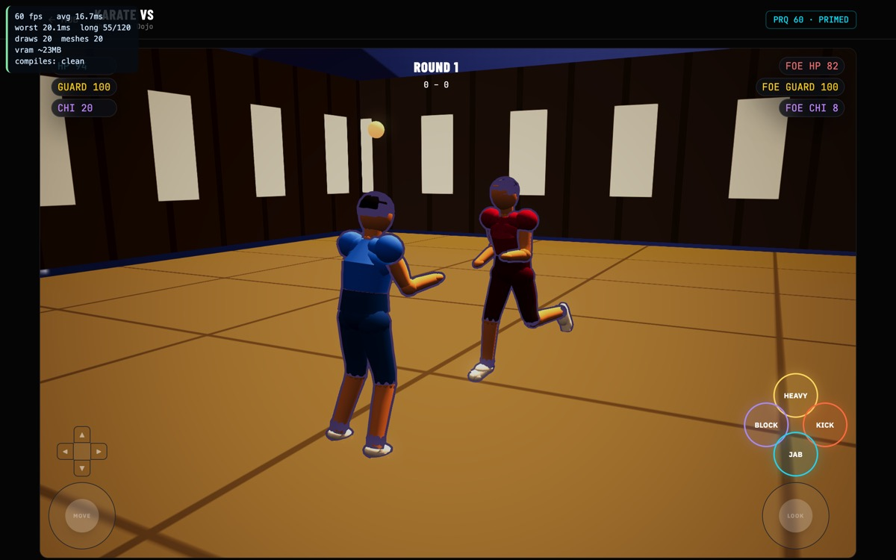

# §7 Completion Checklist — Karate VS

Phase 10 of the convergence pass. Benchmark: **Soul Calibur / Naruto Storm**
(bible §4.1). Both are 3D arena fighters, and that is what the criteria measure.

| § | Item | Result |
|---|---|---|
| 7.1 | Gate 0 verified for this mode's animation set | ✅ 58 checks |
| 7.2 | 10-Phase Convergence Protocol run in full | ✅ all ten, each with a proof |
| 7.3 | Benchmark parity against the locked reference | ✅ 16/16; D1–D3, D6, D7 fixed, D5 ruled, D4 recorded |
| 7.4 | World-Population Protocol applied | ✅ L1–L5 below |
| 7.5 | Five-tab shell conventions intact | ✅ untouched |
| 7.6 | vitest suite still green | ✅ `npm test` — 4 files, 57 tests |
| 7.7 | No orphaned-mode work smuggled in | ✅ |
| 7.8 | No scope bleed into §6 features | ✅ |

## Verdict: **SIGNED OFF — 8 of 8.**

Fifth mode through the checklist, after 3PT, Dunk, 3v3 and 1v1.

---

## Phase-by-phase

| Phase | Proof |
|---|---|
| 0 Platform preconditions | `gate0-rig-tests` 58 green |
| 1 Concept Lock | `docs/concept-lock/karate-vs.md` — 16 criteria, 7 deviations |
| 2 Core mechanics | `fight-balance-tests` 5 green — the rival is beatable, and a slow attack is not easier to guard than a fast one |
| 3 Camera & framing | **0 `[FEL-FRAME]`** across runs; three-quarter view holds both fighters |
| 4 Reachability | registry `karate_vs` · `ENABLED_BABYLON_MODES` · `/play/karate-vs` · `karate-vs-babylon.tsx` · `MODE_VERBS` |
| 5 Input & control schema | verb key `karate_vs` matches the overlay; forward direction fixed (D1) |
| 6 World population | L1–L5 below |
| 7 Audio | dojo bed, per-strike whoosh/impact, a distinct cue for the DRAGON |
| 8 Polish | hitstop + slow-mo on clean hits, parry stagger, COMBO xN readout |
| 9 Playtest | driven on **`/play/karate-vs`**, logged in: 0 frame warnings, 0 missing clips, 0 errors, real damage on both sides |
| 10 This document | — |



---

## What the pass found

- **The rival could not be hit.** A per-frame reactive-guard roll made it block
  ~98% of everything; the player dealt zero damage across a whole match. This
  was the mode's headline defect and nothing surfaced it — every subsystem was
  behaving as written.
- **One fighter hid the other.** `fitTwo` puts the camera on the line *between*
  the fighters, which is right for a chase cam and exactly wrong for a fighting
  game. Both named benchmarks hold an off-axis three-quarter view for precisely
  this reason.
- **Forward walked you away from the opponent** — the third distinct site of the
  platform stick disagreement, and one the `LocalInputSource` normalisation did
  **not** reach, because this mode reads `stickX`/`stickY` raw. Fixing a seam
  only fixes the consumers that use the seam.
- **The camera collapsed against the dojo wall**, because the fight area was not
  inset from the room.
- **The host did not defer its harness start** — the StrictMode double-mount that
  rendered 3v3 as an empty void. `[FEL-SPAWN]` was already logging twice.

## World-Population Protocol — applied

```
L1 ground plane .......... PASS  18x18 tatami with a painted mat grid; the fight
                                 area is now inset to 9x9 so the camera clears
L2 play-critical props ... PASS  two fighters; a dojo needs no other objects
L3 boundary .............. PASS  venueBox wood walls, 20x20
L4 crowd and life ........ N-A   a dojo is not a stadium. Recorded rather than
                                 forced: the benchmarks' arenas do carry
                                 spectators, so this is a deliberate reading of
                                 the venue, not an oversight — see D4
L5 ambience .............. PASS  hanging lanterns, warm dojo key light
budget ................... draws 20  meshes 20  frame 16.7ms @ 60fps
legibility ............... PASS  nothing competes with the two fighters
```

## Carry-forwards

1. **D4 — the venue is thin at 20 meshes.** It is a correctly built dojo (tatami,
   wood walls, lanterns) rather than an empty room, but Soul Calibur and Naruto
   Storm both treat the arena as a character. A dressing pass would earn its
   keep; it is not a parity failure.
2. **D5 — ring-out ruled out of scope.** Soul Calibur's signature loss condition.
   Naruto Storm has no such rule and the benchmark names both, so `ARENA_HALF`
   clamps rather than eliminates.
3. **Karate Endless still has a pre-existing `[FEL-FRAME]` issue** and its forward
   direction is **unverified** — it is a different mode and was not part of this
   pass, but it shares `FightCore`, so it inherits the reactive-guard fix and
   should be re-measured when its own pass runs.
4. **Phase 9 has not run on real hardware** — same limitation as every other mode.
