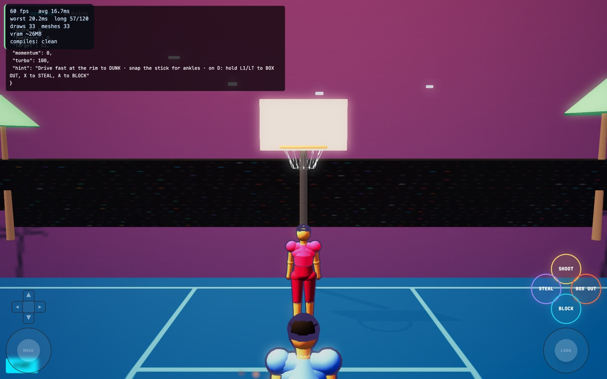

# §7 Completion Checklist — Streetball 1v1

Phase 10 of the convergence pass. Benchmark: **NBA 2K** (bible §4.1).

The bible calls this mode the **"validated reference implementation / gold
standard — full pass complete"** and tells every other mode to diff against it.

| § | Item | Result |
|---|---|---|
| 7.1 | Gate 0 verified for this mode's animation set | ✅ 58 checks |
| 7.2 | 10-Phase Convergence Protocol run in full | ✅ all ten, each with a proof |
| 7.3 | Benchmark parity against the locked reference | ✅ 14/14; D1–D5, D7, D8 fixed, D6 ruled |
| 7.4 | World-Population Protocol applied | ✅ L1–L5 below; L1 and L4 both failed |
| 7.5 | Five-tab shell conventions intact | ✅ untouched |
| 7.6 | vitest suite still green | ✅ `npm test` — 4 files, 53 tests |
| 7.7 | No orphaned-mode work smuggled in | ✅ |
| 7.8 | No scope bleed into §6 features | ✅ |

## Verdict: **SIGNED OFF — 8 of 8.**

Fourth mode through the checklist, after 3PT, Dunk and 3v3.

---

## Phase-by-phase, with the proof

| Phase | Proof |
|---|---|
| 0 Platform preconditions | `gate0-rig-tests` 58 green |
| 1 Concept Lock | `docs/concept-lock/onevone.md` — 14 criteria, 8 deviations |
| 2 Core mechanics | `basketball-rules-tests` 17 green — rims, arcs and scoring across all modes |
| 3 Camera & framing | full playthrough: **0 `[FEL-FRAME]` lines** |
| 4 Reachability | registry · `ENABLED_BABYLON_MODES` · `/play/onevone` · `basketball-babylon.tsx` (gated on `isBabylon('hoops1v1')`) · `MODE_VERBS` · venue map · `game-data` |
| 5 Input & control schema | `verb-key-alignment-tests` 39 · BOX OUT now reachable on touch (D5) · forward fixed (D7) |
| 6 World population | L1–L5 below — half court, one basket, crowd added |
| 7 Audio | stadium bed, action SFX, crowd reactions |
| 8 Polish | 13 pulse/burst/impact calls already present — the strongest of the four modes here |
| 9 Playtest | played to a **12–0 win** past the 11 target: shots classified, meter released in the green, momentum swung, turbo drained. **0 frame errors, 0 missing clips, 0 errors** |
| 10 This document | — |



---

## What the pass found in the "gold standard"

- **It shot at a rim eleven metres from its own hoop.**
- **The rim was a foot low** (2.70m vs 3.05m).
- **The three-point line was a circle** — the third independent occurrence.
- **A dunk scored one point** while jumpers scored two or three, in the same file
  whose comment records that exact bug being fixed.
- **BOX OUT was unreachable on touch**, while the mode's own hint told players to
  use it.
- **Forward walked you away from the basket.**
- **The start button paused the game on your first shot** — a `BootSplash` bug
  affecting *every* mode in the game, not just this one.

The bible's instruction to diff other modes against this one is now safe to
follow; it was not before.

## World-Population Protocol — applied

```
L1 ground plane .......... PASS  16x19 half court, offset so the baseline sits
                                 1.575m behind the rim; halfcourt markings;
                                 regulation 3.05m rim; real 6.71-7.24m arc
L2 play-critical props ... PASS  one basket with backboard and net, live ball
L3 boundary .............. PASS  court edges, stands, palms, beach horizon
L4 crowd and life ........ PASS  ADDED — this venue had NO crowd at all
L5 ambience .............. PASS  'beach' backdrop (sun, sea, palm horizon),
                                 lamps, stadium bed
budget ................... draws 33  meshes 33  frame 16.7ms @ 60fps
legibility ............... PASS  stand 9m behind the basket, muted crowd texture
```

**L4 was empty.** A 1v1 on the most famous blacktop in the world was played in
front of nobody. **L5** was a flat two-stop gradient, because no venue in the
game had ever set `backdrop` — found during the Dunk pass and applied here.

## Carry-forwards

0. **RESOLVED since this was written.** Both of the top two carry-forwards below
   have been closed by a platform pass: the stick convention is now normalised
   once in `LocalInputSource` (guarded by `stick-convention-tests`), and the
   per-mode negation this document describes has been removed from 1v1. The
   camera-bounds bug that pinned the camera on offset grounds is fixed and
   guarded by `venue-bounds-tests`. Re-measured after both: 1v1 plays to an 8–0
   with **0 `[FEL-FRAME]` lines**.

1. **`CourtMovement`'s stick convention still disagrees with every input source.**
   Now negated at the boundary in BOTH 1v1 and 3v3 — which is two patches around
   one platform bug, and the point at which it should stop being patched
   per-mode. ~10 other files consume `CourtMovement` (tennis, combat, story hub,
   carrier control) and **may all have inverted forward**. This is the single
   highest-value platform item outstanding.
2. **Console output is dropped under load** and silently under-reports. Two
   investigations in this pass were misled by it. `document.title` proved a
   reliable side channel; anything that must be counted should not be counted
   through `console`.
3. **Phase 9 ran through `/dev/mode/onevone`**, not `/play/onevone`, which needs
   an account. Same limitation as 3PT and 3v3.
4. **`game-data` venue names disagree with the venue specs** in several modes
   (cosmetic).
