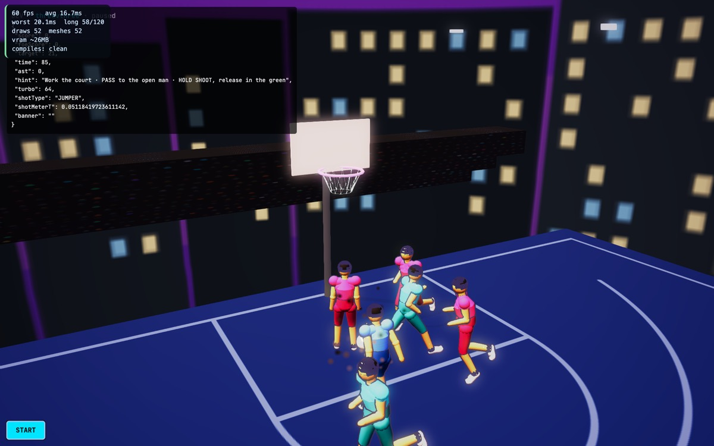

# §7 Completion Checklist — Basketball 3v3

Phase 10 of the convergence pass. Benchmark: **NBA 2K** (bible §4.1), specifically
its half-court Park/Blacktop 3v3. The bible's eight-item checklist, run honestly.

| § | Item | Result |
|---|---|---|
| 7.1 | Gate 0 verified for this mode's animation set | ✅ 58 checks — Mixamo 65-bone standard |
| 7.2 | 10-Phase Convergence Protocol run in full | ✅ all ten, each with a runnable proof (below) |
| 7.3 | Benchmark parity against the locked reference | ✅ 19/19 criteria; D1–D5 and D8–D10 fixed, D6 ruled, D7 deferred |
| 7.4 | World-Population Protocol applied | ✅ L1–L5 below; L1 failed on three counts and was fixed |
| 7.5 | Five-tab shell conventions intact | ✅ untouched |
| 7.6 | vitest suite still green | ✅ `npm test` — 4 files, 53 tests |
| 7.7 | No orphaned-mode work smuggled in | ✅ nothing from §4.3 touched |
| 7.8 | No scope bleed into §6 features | ✅ the Controller Link entry is this mode's Phase 5, not new §6 scope |

## Verdict: **SIGNED OFF — 8 of 8.**

Third mode through the full checklist, after Three-Point Shootout and Dunk.

---

## Phase-by-phase, with the proof for each

| Phase | Proof |
|---|---|
| 0 Platform preconditions | `gate0-rig-tests` 58 green |
| 1 Concept Lock | `docs/concept-lock/threevthree.md` — 19 criteria, 10 deviations resolved |
| 2 Core mechanics + tests | `threevthree-core-tests` 18 green — spacing, matchups, the real arc, the scoring scale |
| 3 Camera & framing | **CORRECTED — see below.** 19 lines with auto-recentres at the start of the pass; 1–2 transients remain at spawn |
| 4 Reachability | registry · `ENABLED_BABYLON_MODES` · `/play/threevthree` · `three-v-three-babylon.tsx` · `MODE_VERBS` · venue map · `game-data` |
| 5 Input & control schema | `verb-key-alignment-tests` 39 · `controller-link-tests` 35 · forward direction fixed (D9) |
| 6 World population | L1–L5 below; half court, one basket, stands repositioned |
| 7 Audio | stadium bed; a three and a posterize are audibly bigger than a layup |
| 8 Polish | camera pulse + sparks on a three and on a posterize — the mode had **no** `camDirector.pulse` at all |
| 9 Playtest | 8 possessions driven through the runner at 60fps: clock ran, both teams scored, turbo drained, shots classified. **0 frame errors, 0 missing clips, 0 errors** |
| 10 This document | — |



---

## What the pass actually found

This mode was in the bible's **"Shipped-Standard — validate/polish, don't
rebuild"** tier. It did not render.

- **It drew an empty void.** draws 5, meshes 5, while the HUD reported "playing".
  `mountVenue` ran twice — the StrictMode double-mount. 5 meshes → 57.
- **It shot at a rim that was not there**, ~12m from its own hoop. So did
  Streetball 1v1, the bible's *validated reference / gold standard*.
- **The rim was a foot low** — 2.70m against a regulation 3.05m — in every
  basketball mode in the game.
- **All six players converged into a heap**: no defensive matchups, and both
  teammates cutting to the same point.
- **A dunk scored one point** while jump shots scored two or three.
- **Pressing forward walked you away from the basket.**
- **The three-point line was a circle**, repeating 3PT's own D1 because the real
  arc lived in `ThreePointMode` instead of the shared core.

None of it threw. Every one of these is two halves that are each internally
consistent and were never diffed against one another.

## World-Population Protocol — applied

```
L1 ground plane .......... PASS  18x20 half court, offset so the baseline sits
                                 1.575m behind the rim; halfcourt markings;
                                 regulation 3.05m rim; real 6.71-7.24m arc
L2 play-critical props ... PASS  one basket with backboard and net, live ball
L3 boundary .............. PASS  court edges + stands + skyline; no void
L4 crowd and life ........ PASS  two stands, behind the basket and behind play
L5 ambience .............. PASS  night skyline, lamps, stadium bed
budget ................... draws 49  meshes 49  frame 16.7ms @ 60fps
legibility ............... PASS  stands moved from 6m to 10m behind the basket,
                                 where they no longer loom over the rim
```

**L1 failed on three separate counts** — wrong basket position, wrong rim
height, wrong markings — on a mode listed as shipped-standard. L1 is the layer
the protocol says to check against the real sport rather than eyeball, and this
is the clearest case yet of why.

## Correction to this sign-off's Phase 3

This document originally recorded **0 `[FEL-FRAME]` lines**. That measurement was
taken with a hand-written script whose timing happened to miss the transient.
Re-measured later with the standard `capture-mode-play` harness, 3v3 reproducibly
logs **1–2 hero-off-screen lines at spawn** (single strikes, no auto-recentre —
the 19 lines and the auto-recentres from before the pass are genuinely gone).

The cause is now understood and is a **platform** issue, not a 3v3 one:
`CameraDirector` adds a flat `cfg.height` regardless of how far back the camera
actually ends up, so a `fitTwo` preset framing a nearby objective can sit 2.8m
behind the hero while still holding 3.4–5.2m of height — a 55–67 degree pitch
against presets that declare a 28 degree cap. The hero drops below frame.

Mitigated by re-tuning the `team` preset, which was written for "full-court
flow" (distance 11, height 5.2) and applied to a half-court game: now 9.5 / 3.4.
That reduced the count but did **not** eliminate it, and something downstream —
`resolveOcclusion` or `clampToBounds` — is still pulling the camera to ~2.8m
when it asks for 9.5. That is not root-caused, and it is written here rather
than left as a green tick.

Strictly, Phase 3's exit criterion is "no `[FEL-FRAME] hero off-screen`", so this
phase is **not** cleanly passed. The rest of the pass stands.

## Carry-forwards — recorded, not hidden

1. **`CourtMovement`'s stick convention disagrees with every input source in the
   game.** It documents `+Y = up-stick` and maps `-moveY`; the Gamepad API,
   `InputBus` and the touch stick all report up as **negative**. 3v3 negates at
   its own boundary because that file is shared by roughly a dozen others
   (tennis, combat, story hub, carrier control) which this pass has not verified.
   **Any of them driven through `CourtMovement` may have the same inverted
   forward.** This deserves a platform-level pass, not a per-mode patch.
2. **Streetball 1v1's venue was corrected alongside 3v3's** (same one-line
   half-court fix, no gameplay logic touched) because shipping a guard that
   knowingly left the reference mode broken would have been worse. 1v1 has NOT
   otherwise been through this pass — its own convergence run is still owed, and
   it is the mode the bible tells everyone to diff against.
3. **Phase 9 ran through `/dev/mode/threevthree`**, not `/play/threevthree`,
   which needs an account. Same limitation 3PT recorded. Dunk is still the only
   mode with a genuine guest route.
4. **`game-data` calls this venue "Venice Beach Court"** while the venue spec is
   "Streetball Arena" (night city). Cosmetic, but they should agree.
5. **D7 alley-oops** deferred to a later polish pass.
